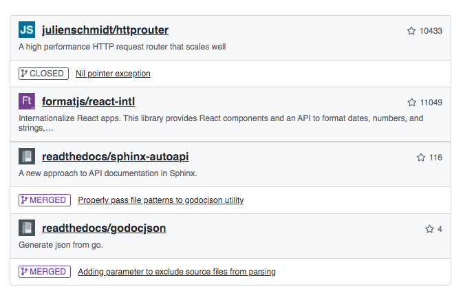

# gh-contrib-widget
Simple widget that shows your last contribution to public open-source projects.
Only things you made to other folks stuff are shown. Your own projects will be filtered out.

### Example



### Usage

Add Styles and JS resources to your page:
```
<link rel="stylesheet" type="text/css" href="https://cdnjs.cloudflare.com/ajax/libs/font-awesome/5.11.2/css/all.css"/>
<link rel="stylesheet" type="text/css" href="https://cdn.jsdelivr.net/gh/orn0t/gh-contrib-widget@1.0/dist/gh-contrib-widget.min.css"/>
<script src="https://cdn.jsdelivr.net/gh/orn0t/gh-contrib-widget@1.0/dist/gh-contrib-widget.min.js"></script>
```
Add empty placeholder where you need widget to be shown:
```
<div id="my-gh-widget"></div>
```
Init the widget in your js script:
```
<script>
  GhContribWidget.init("my-gh-widget", <Your_Github_login>, <Your_Github_API_key>);
</script>
```
